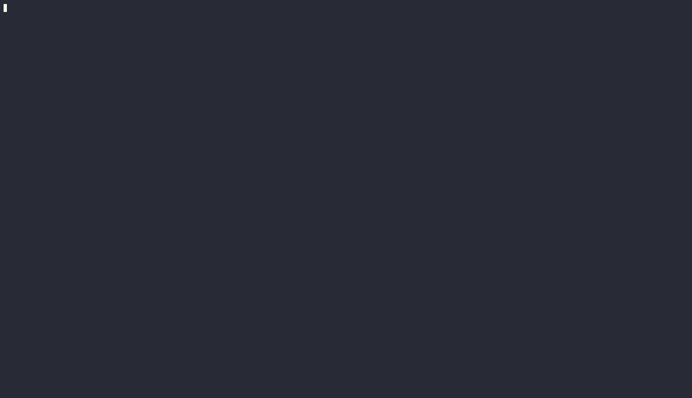

# Peek

[](https://github.com/sousandrei/peek/actions/workflows/ci.yml)

Peek lets you explore a container image one layer at a time. It’s a Rust project inspired by [Dive](https://github.com/wagoodman).



## What it does

Run Peek to open an image in the terminal UI. Browse layers and files, see what changed between layers, filter paths, and inspect file metadata.

Run `peek analyze IMAGE` to print a readable summary of added, changed, and deleted files. Add `--json` to print JSON to stdout; combine it with `--output PATH` to write JSON to a new file. Use `--layers full` with JSON to include the filesystem after each layer.

Peek can inspect images through Docker or Podman, or read a saved Docker archive. It analyzes images you build with your container tool; it does not build images itself.

## Installation

TODO: add installation instructions.

## Usage

Open an image in the TUI:

```sh
peek ubuntu:latest
```

Use the arrow keys or mouse to browse. Press `?` for shortcuts or `q` to quit.

Print layer changes, or export them as JSON:

```sh
peek analyze ubuntu:latest
peek analyze ubuntu:latest --json
peek analyze ubuntu:latest --json --output changes.json
```

For a cumulative filesystem view in JSON:

```sh
peek analyze ubuntu:latest --json --layers full --output filesystem.json
```

## Development

With Rust and Cargo installed:

```sh
cargo run -- ubuntu:latest
cargo test --locked --all-targets
cargo fmt --all -- --check
cargo clippy --locked --all-targets -- -D warnings
```

Tests use Docker and Buildx.

Thanks to Alex Goodman for making Dive and inspiring Peek.
